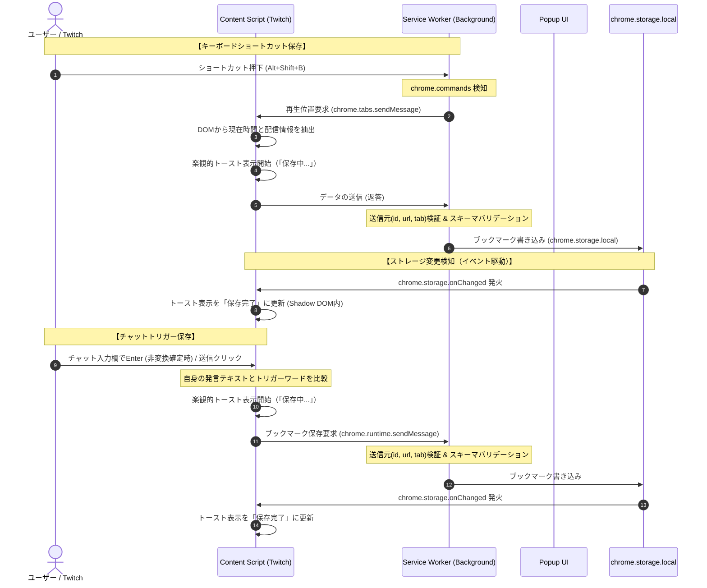

# Implementation Plan: Clip Bookmark Trigger (クリップ ブックマーク・トリガー機能)

**Branch**: `001-clip-bookmark` | **Date**: 2026-07-04 | **Spec**: [spec.md](file:///Users/shugo/Develops/ushios/clip-bookmark/specs/001-clip-bookmark/spec.md)

**Input**: Feature specification from `specs/001-clip-bookmark/spec.md`

## Summary
Twitchの配信またはVOD（アーカイブ）視聴中に、キーボードショートカットまたはチャット入力欄での指定キーワード（カスタム可能）の送信をトリガーとして、その時点の経過時間（または再生位置）をブックマークとして保存し、後からポップアップUIで確認・該当時間へのジャンプができるChrome拡張機能を開発します。

本計画書は、設計エージェントの提案に対する3名の専門レビュアー（Security, DRY, UX/Testing）による査読と改善提案をすべて反映した最終設計書です。

---

## Technical Context

*   **Language/Version**: TypeScript 5.x / JavaScript (ES6+)
*   **Manifest Version**: Manifest V3
*   **Primary Dependencies**: なし（Vanilla JS/TSによる極限の軽量化、バンドルサイズ削減）
*   **Storage**: `chrome.storage.local` (ブックマーク履歴の保存用), `chrome.storage.sync` (トリガーワード設定の同期用)
*   **Testing**: Vitest (Chrome APIおよびDOMのモックによる単体テスト・結合テスト)
*   **Target Platform**: Google Chrome (Manifest V3)
*   **Project Type**: chrome-extension
*   **Performance Goals**:
    *   打刻アクションからトースト表示（楽観的UI更新）開始まで **0.1秒以下**
    *   拡張機能ポップアップUIの起動完了（100件表示含む）まで **0.2秒以下**
    *   チャット監視の無効化（設定トグル）によるCPU負荷 **0%** の達成
*   **Constraints**:
    *   Manifest V3のセキュリティ要件（`unsafe-eval`の排除、外部スクリプト読み込み禁止、`externally_connectable`の不使用による通信遮断）
    *   TwitchのDOM要素のロード遅延や動的変更への追従

---

## Constitution Check
*憲章で定義された以下の原則を満たしていることを検証します。*

*   **I. Speckit駆動フロー**: `spec.md` を作成し、現在 `plan.md`（設計・計画）の策定段階。不明点についてはQ&Aによる明確化を行い、3名の別モデルによるレビューを完了。
*   **II. オーケストレーション設計**: 3名の設計担当（Security, DRY, UX）の提案を統合し、その後別の3名のレビュアー（Security, DRY, UX/Testing）によるレビューを経て本設計を確定。
*   **III. 開発とレビューの委譲**: 実装は開発エージェントに委譲し、コードレビューはまた別のエージェントに委譲する。
*   **IV. セキュリティ & DRY**: 権限の最小化、XSS対策、Shadow DOMの適用、`StorageManager` によるストレージ隠蔽とジェネリック化、`BasePlatformAdapter` による共通プレイヤーロジックのDRY化。
*   **V. テスト実装とレビュー**: Vitestによるテストコードを同時実装し、テストもレビュー対象とする。

---

## Project Structure

DRY原則および関心の分離（Separation of Concerns）に基づき、以下のディレクトリ構造を採用します。

```text
src/
├── manifest.json         # 拡張機能マニフェスト (Manifest V3)
├── background/           # Service Worker (バックグラウンド処理)
│   ├── index.ts          # エントリポイント (コマンド受付・中継)
│   └── handlers/         # メッセージハンドリング、バリデーション
├── content/              # Content Script (ページDOM操作・プレイヤー時間取得)
│   ├── index.ts          # ライフサイクル管理、エントリポイント
│   ├── platforms/        # プラットフォーム依存処理の抽象化
│   │   ├── adapter.interface.ts
│   │   ├── base.adapter.ts        # 共通のvideo要素操作を実装する抽象クラス
│   │   ├── twitch.adapter.ts      # Twitch固有のアダプター
│   │   └── youtube.adapter.ts     # 将来の拡張用 (YouTube)
│   ├── observers/        # トリガー監視クラス
│   │   ├── chat.observer.ts       # チャット入力監視
│   │   └── command.observer.ts    # ショートカット監視
│   └── ui/               # トースト通知などのインラインUI (Shadow DOM内描画)
├── popup/                # ポップアップUI (履歴確認・削除・設定)
│   ├── index.html
│   ├── index.css         # リファクタリング時はインライン化
│   └── index.ts          # Vanilla TSによる高速描画UIロジック
└── common/               # 共有モジュール (各ランタイム共通)
    ├── models/           # 型定義およびバリデーション
    │   ├── bookmark.model.ts
    │   ├── settings.model.ts
    │   └── messages.ts   # メッセージ通信定義
    ├── storage/          # ストレージアクセスマネージャー
    │   └── storage.manager.ts
    └── utils/            # 汎用ヘルパー (時間パース、URL生成、セキュリティ)
        ├── time.ts
        ├── url.ts
        └── security.ts   # サニタイズ、Sender検証
```

---

## System Design & Data Flow

### 1. シーケンス・データフロー（イベント駆動型への移行）
Service WorkerとContent Script間の結合度を下げるため、`chrome.storage.onChanged` を介した自律的なイベント駆動型トースト通知を採用します。また、レスポンス目標（0.3秒）を確実に満たすため、打刻を検知した時点で即座に画面トーストを描画する「楽観的UI更新」を適用します。



### 2. メッセージプロトコル定義
```typescript
// src/common/models/messages.ts
export const MESSAGE_ACTIONS = {
  TRIGGER_BOOKMARK: 'TRIGGER_BOOKMARK',
  SAVE_BOOKMARK: 'SAVE_BOOKMARK',
} as const;

export type MessageAction = typeof MESSAGE_ACTIONS[keyof typeof MESSAGE_ACTIONS];

export interface ExtensionMessage<T = unknown> {
  action: MessageAction;
  payload?: T;
}
```

---

## Detailed Specifications by Concern

### 1. プラットフォーム抽象化設計 (将来の拡張性)
Content Scriptは抽象化された `PlatformAdapter` インターフェースを使用します。チャット機能の有無による影響を避けるため、チャット監視機能は `ChatObservable` インターフェースとして分離します。

```typescript
// src/content/platforms/adapter.interface.ts
export interface ChatMessage {
  sender: string;
  text: string;
}

export type ChatCallback = (message: ChatMessage) => void;

export interface PlatformAdapter {
  getCurrentTime(): Promise<number>;
  getChannelName(): Promise<string>;
  getVideoTitle(): Promise<string>;
  getVideoUrl(): Promise<string>;
  isLive(): Promise<boolean>;
  destroy(): void;
}

export interface ChatObservable {
  observeChat(callback: ChatCallback): void;
}
```

#### 基底クラス `BasePlatformAdapter` (DRY)
TwitchおよびYouTubeに共通するHTML5 `<video>` 要素の再生時間取得などの汎用操作を `BasePlatformAdapter` 抽象クラスに集約し、各アダプターのコード重複を徹底的に排除します。

### 2. チャット監視の超低負荷設計
*   **チャット監視機能のON/OFFトグル (Settings)**:
    設定に `enableChatObserver: boolean`（デフォルト: true）を追加します。無効な場合、Content Scriptは `MutationObserver` の接続を完全に遮断（`disconnect()`）し、不要な監視処理によるCPU負荷を **0%** に抑えます。
*   **アプローチA（イベントリスナ方式）**:
    チャット入力欄での `keydown` イベント監視時、`event.isComposing` をチェックしてIMEによる日本語変換確定時のEnter入力を除外します。
*   **アプローチB（MutationObserver方式）**:
    `addedNodes` 監視時に送信者が自分自身（`.chat-line__message--self`）でない場合は、コールバックの先頭で即座に早期リターン (Early Return) を実行します。

### 3. セキュリティ設計 (Security & Safety)
*   **マニフェスト強化**: `externally_connectable` をマニフェストから明示的に除外（または空に設定）し、外部からのメッセージインジェクション経路を遮断します。
*   **多層メッセージ検証**: Service WorkerでContent Scriptからのメッセージを受信する際、`sender.id`（自拡張機能ID）、`sender.url`（Twitchオリジン）、および `sender.tab`（送信元タブオブジェクトの存在）を検証します。
*   **XSS対策とShadow DOM**:
    *   DOMからスクレイピングしたタイトルやチャンネル名は、保存および画面挿入時に最大255文字への切り捨て（Truncate）と制御文字の除去（サニタイズ）を行います。
    *   画面挿入時は `textContent` を徹底し、トースト通知UIは **Shadow DOM** を用いてカプセル化してTwitchのCSSやJSからの干渉・干渉によるXSSを防止します。
    *   遷移先URLは正規表現 `^https:\/\/(?:[a-z0-9-]+\.)?twitch\.tv\/(?:videos\/\d+|\w+)(?:\?t=[0-9a-zA-Z_]+)?$` に合致するもののみを `chrome.tabs.create` に渡します。

### 4. データ件数制限とローテーション (FIFO)
`chrome.storage.local` の肥大化やパフォーマンス低下を防ぐため、ブックマークの最大保存件数を **1,000件** に制限します。保存の直前に件数をチェックし、上限を超える場合は最も古いブックマークを自動で削除（FIFO）するローテーション処理を `StorageManager` 内に実装します。

### 5. トーストUIとフルスクリーン対策
*   **挿入ターゲットの変更**: トースト要素を `document.body` ではなく、Twitchのビデオプレイヤーコンテナ（`.video-player__container` など）内に挿入します。これにより、HTML5のフルスクリーン表示（`requestFullscreen`）実行時も、トーストが映像の最前面に隠れることなく正しく表示されます。
*   **非ブロッキング＆インタラクション**: トーストコンテナ自体は `pointer-events: none` としつつ、トースト内に配置する「削除/閉じる」ボタンに対しては `pointer-events: auto` を適用するハイブリッド構成とします。

---

## 型安全なデータモデル

### `Bookmark` および `Settings` スキーマ
```typescript
// src/common/models/bookmark.model.ts
export interface Bookmark {
  readonly id: string;            // ユニークID (timestamp or UUID)
  readonly platform: 'twitch' | 'youtube' | string; // 遷移先URLのパース用
  readonly channelName: string;   // 配信者・チャンネル名
  readonly title: string;         // 動画・配信タイトル
  readonly videoUrl: string;      // VODのベースURL
  readonly timestamp: string;     // 記録した絶対日時 (ISO 8601)
  readonly relativeTime: number;  // 再生位置 (秒数、0以上 172800秒[48時間]以内)
  readonly isLive: boolean;       // ライブ中打刻フラグ
  readonly metadata?: Record<string, unknown>; // 将来のプラットフォーム固有データ拡張用
}

// src/common/models/settings.model.ts
export interface Settings {
  readonly triggerWords: string[];
  readonly enableChatObserver: boolean; // チャット監視のON/OFF
}
```

---

## Testing Strategy (テスト方針)

憲章 V に従い、Vitest を用いた単体・結合テストコードを同時実装します。

### 主要テストケース
1.  **`SecurityValidator` の境界テスト**:
    *   不正な拡張機能IDやOrigin、`sender.tab` が欠落したメッセージ送信を拒否できること。
    *   `javascript:` 等の不正なスキームを含むURLが拒否され、Twitchの正しいURLのみが許可されること。
2.  **`StorageManager` ローテーションテスト**:
    *   ブックマーク件数が 1,000件 に達している状態で新規保存を実行した際、最も古いブックマークが削除され、総件数が 1,000件 に維持されること。
3.  **`BasePlatformAdapter` 例外耐性テスト**:
    *   プレイヤー要素がロードされる前の未検出状態において、適切に例外（または空データ）がハンドリングされ、拡張機能がクラッシュしないこと。
4.  **チャット監視フィルタリングテスト**:
    *   自分以外のコメントや、IME変換途中のEnterキーによる打刻が無視されること。
    *   設定でチャット監視をOFFにした場合、`MutationObserver` が切断されること。
